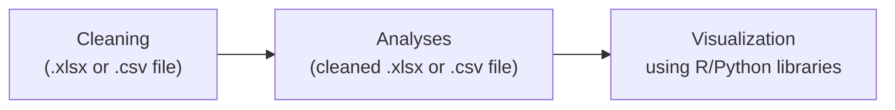

# Giant Clam Microbiome Project

## About The Project
Giant Clam Microbiome Project is a repository of my thesis study at the Marine Science Institute, University of the Philippines Diliman. In the study, we transplanted juvenile giant clams to sites with increasing proximity to fish farms and profiled bacterial composition in ctenidia (or gills) and mantle tissues using 16S rRNA sequencing. The study is comprised of large dataset such as sequence data, environmental parameters, and physiological data.

Hence in this project, I aim to organize the study contents by breaking them into branches. Here's what to expect as you browse through:
+ **Data** : this branch contains the raw and cleaned environmental parameters obtained during field sampling. It also contains the giant clam physiological data, and prokaryotic microbiome sequence data.
+ **Scripts** : contains Bash/Shell, R and Python scripts used to clean, analyze, and visualize data
+ **Output** : contains visualized data such as figures, tables, posters, and powerpoint presentation

## Prerequisites

 

## RoadMap
> **Data**

>> *Sequence Data*
>> 
>> 

>> ##### Legend:
>> Sample Types | Abbreviation
>> -------------|-------------
>> Ctenidia     | C                  
>> Mantle       | M
>> Seawater     | W
>> ______________________________
>> Sample Sites  | Abbreviation
>> --------------|---------------
>> Malilnep      | Mal
>> Silaki        | Sil
>> Lucero        | Luc
>> Tomasa        | Tom

>> *Environmental Data*
>>
>> 

>> ##### Legend:
>> Parameters | Abbreviation
>> -----------|-------------
>> Temperature|Temp
>> Dissolved Oxygen | DO
>> Acidity | pH
>> Salinity | Sal
>> Sediment trap volume or Current Velocity | Sed
>> Total Suspended Solids | TSS
>> Light Intensity | Flux

>> *Physiological Response of juvenile giant clam*
>>  

